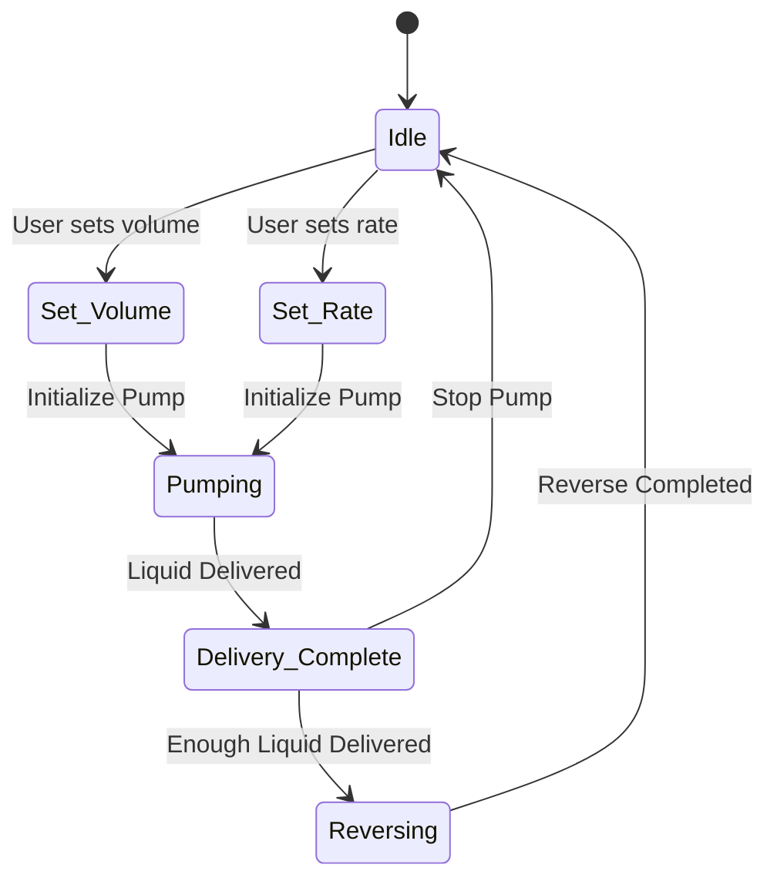

# DIY Syringe Pump

## Introduction

Welcome to our DIY Syringe Pump project! This project utilizes the ESP32 Wroom 3 microcontroller to control a stepper motor, allowing for precise control of fluid delivery in various applications. Our syringe pump is designed to be user-friendly and can be adapted for different types of syringes, making it suitable for both educational and practical uses in laboratories or home settings.

## Project Overview

The syringe pump is controlled via an intuitive interface, and it can be programmed to deliver specific volumes of liquid at desired rates. This project demonstrates the integration of hardware and software, showcasing our skills in electronics, programming, and system design.

## Electronic Components


| Component                           | Product Information                                            | Vendor      | Cost (VND) | Note                                                        |
|-------------------------------------|--------------------------------------------------------------|-------------|------------|-------------------------------------------------------------|
| ESP32-WROOM-32U Microcontroller     | WiFi and Bluetooth module, 4MB Flash memory                 | Thegioiic   | 90,000     | Power: 3~3.6VDC, communication: I2C, I2S, PWM, SDIO, SPI, UART |
| Adapter                             | 12V 2A, DC connector 5.5x2.5mm                              | Thegioiic   | 30,000     | 1m length, Input: 100~240VAC, output: 12VDC 2A            |
| LM2596S Voltage Regulator          | 5V output, 3A                                               | Thegioiic   | 16,000     | Input: 5-40VDC, output: 5V 3A, 10W                        |
| MKS TMC2209 Stepper Motor Driver    | 5.5~28VDC input                                             | Thegioiic   | 103,000    |                                                             |
| Push Button                         | 4.5x4.5mm, 5mm height, 3 pins, horizontal mount             | Thegioiic   | 1,200      |                                                             |
| LCD 16x02                           | Blue Background, White Text, 5V, with I2C Driver            | Thegioiic   | 40,000     |                                                             |

## Mechanical Components

| Component                                | Product Information                                       | Vendor        | Cost (VND) | Note                           |
|------------------------------------------|---------------------------------------------------------|---------------|------------|--------------------------------|
| T8 Lead Screw                            | 2mm lead screw pitch, 40cm length                      | Thegioiic     | 63,000     | Includes nut                   |
| LMK8UU Square Flange Bearing             | 8mm inner diameter, 15mm outer diameter, 24mm length   | Thegioiic     | 24,000     |                                |
| KFL08 Bearing Pillow Block               | 8mm inner diameter                                      | Thegioiic     | 17,000     |                                |
| 8mm Linear Rail                          | 40cm length, Stainless Steel 304                       | Thegioiic     |            |                                |
| 17HS1352-P4130 Nema17 Stepper Motor     | 42x42mm size, 1.8° step angle, 0.25Nm torque          | Thegioiic     | 149,000    | 1.7" square flange            |
| D19L25 Flexible Coupling                 | Shaft size 8-8mm, outer diameter 19mm, length 25mm    | Thegioiic     | 16,000     | Used to connect two shafts     |
| Mica Holder                              | Size 60x60x5                                           | Local Vendor   | 30,000     |                                |
## Diagrams

### Flow Chart

```mermaid
graph TD;
    A[Start] --> B{User Input}
    B -->|Set Volume| C[Set Volume to Pump]
    B -->|Set Rate| D[Set Delivery Rate]
    C --> E[Initialize Pump]
    D --> E
    E --> F{Start Pumping}
    F -->|Yes| G[Deliver Liquid]
    G --> H{Is Delivery Complete?}
    H -->|Yes| I[Stop Pump]
    H -->|No| G
    I --> J[End]
 ```   

### Block diagram
```mermaid
graph TD;
    A[User Interface] --> B[Microcontroller - ESP32];
    B --> C[Control Driver-TMC2209];
    C --> D[Stepper Motor-NEMA 17];
    B --> E[Display-LCD I2C 16x2];
    B --> F[Push Buttons];
    H --> B[Microcontroller - ESP32]; 
    G[Voltage 12VDC] --> H[Voltage Regulator-LM2596];

```
### StateDiagram
